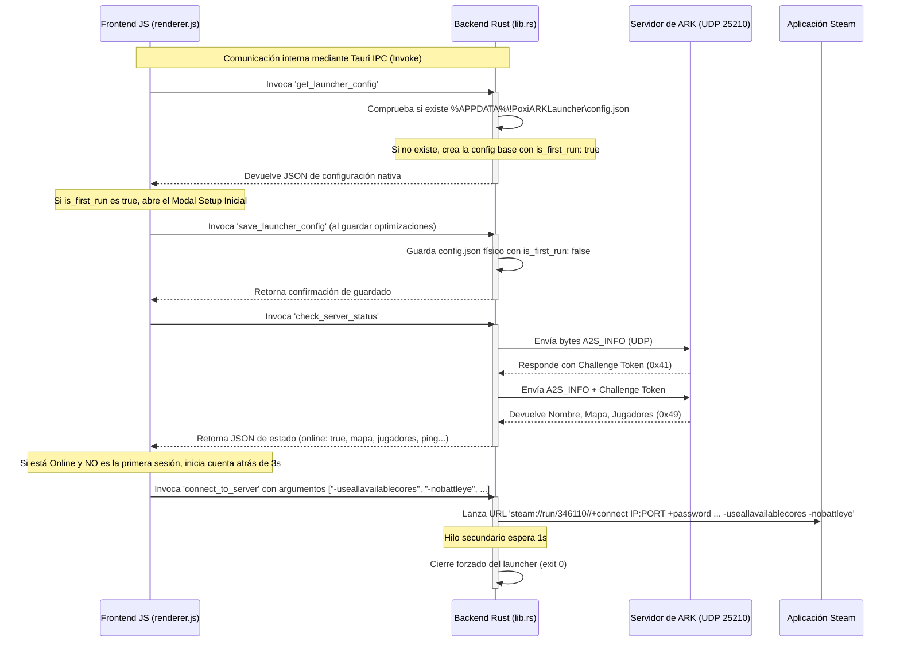
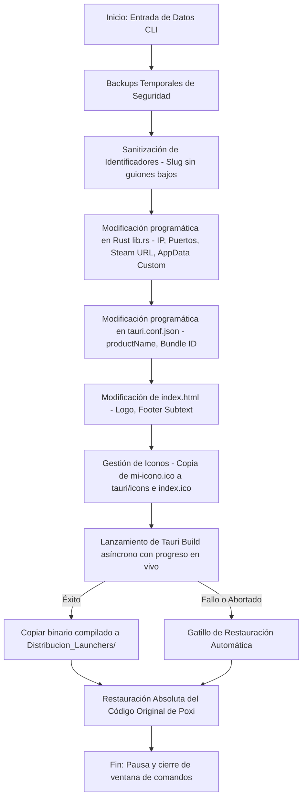

# 🧠 Explicación Detallada del Código — Poxi ARK Launcher 🦕

Esta guía técnica explica paso a paso cómo está construido el launcher, cómo funciona internamente y cómo se comunican las distintas partes del código. Te servirá como referencia para entender, modificar o ampliar el launcher en el futuro sin miedo a romper nada.

---

## 🗺️ Mapa de Arquitectura y Flujo de Comunicación

El launcher funciona conectando tres entornos distintos de forma fluida:



---

## 🦀 1. El Backend en Rust (`src-tauri/src/lib.rs`)

El backend de la aplicación se ejecuta en código nativo de Rust y es responsable de realizar operaciones de bajo nivel (red UDP de sockets, persistencia física en disco y comandos del sistema) que un navegador web estándar no puede realizar por motivos de seguridad.

### 📡 El Protocolo de Consulta UDP y Ping (`check_server_status`)
Los servidores de juegos de Valve (como ARK) utilizan un protocolo de comunicación UDP llamado **Source Engine Query**.

1. **Creación del Socket UDP y Medición de Tiempo:**
   Abre un puerto UDP aleatorio local y mide el tiempo exacto usando `std::time::Instant::now()` antes de enviar el paquete de consulta:
   ```rust
   let start_time = std::time::Instant::now();
   let socket = UdpSocket::bind("0.0.0.0:0")
   ```
   Se le aplica un tiempo de espera de 3.5 segundos (`set_read_timeout`) para evitar que la aplicación se congele si el servidor no responde.

2. **La petición inicial (A2S_INFO):**
   Se crea una trama de bytes estándar que pregunta al servidor: *"¿Quién eres?"*
   ```rust
   let mut base_request = vec![
       0xFF, 0xFF, 0xFF, 0xFF, // Cabecera estándar del motor (Int -1)
       0x54,                   // Carácter 'T' (Identificador A2S_INFO)
       // Cadena "Source Engine Query" terminada en 0x00 (Null)
       0x53, 0x6F, 0x75, 0x72, 0x63, 0x65, 0x20, 0x45, 0x6E, 0x67, 0x69, 0x6E, 0x65, 0x20, 0x51, 0x75, 0x65, 0x72, 0x79, 0x00
   ];
   ```

3. **El Handshake "Challenge" (Desafío):**
   Los servidores modernos de ARK no responden con los datos a la primera para evitar ataques DDoS. Envían primero una cabecera de desafío (`0x41`) y **4 bytes aleatorios** (Challenge Token).
   * Rust detecta este paquete `0x41`.
   * Concatena estos 4 bytes al final de la petición original `base_request`.
   * Vuelve a enviar la petición completa por UDP.

4. **Decodificación de la Respuesta (`0x49`):**
   El servidor responde con un paquete que comienza por `0x49` (carácter 'I') con los strings del servidor terminados en bytes `0x00` (nulos).
   Para leerlos de manera limpia, Rust utiliza una función auxiliar `read_utf8_string` que busca el byte `0`, decodifica el texto en formato UTF-8 seguro, y calcula la latencia (Ping):
   ```rust
   let ping = start_time.elapsed().as_millis() as u32;
   ```

### 💾 Persistencia de Ajustes en AppData (`get_config_dir`)
Para guardar las configuraciones de manera física e independiente del navegador web, el launcher crea una carpeta dedicada en la zona oculta del sistema:
* **Función auxiliar de ruta:**
  ```rust
  fn get_config_dir() -> Result<std::path::PathBuf, String> {
      let appdata_path = std::env::var("APPDATA")
          .map_err(|e| format!("Error al obtener la variable de entorno APPDATA: {}", e))?;
      Ok(std::path::PathBuf::from(appdata_path).join("!PoxiARKLauncher"))
  }
  ```
  Esto mapea el directorio exacto a `C:\Users\TuUsuario\AppData\Roaming\!PoxiARKLauncher`.
* **Lectura/Escritura JSON:** Los comandos `get_launcher_config` y `save_launcher_config` deserializan y serializan el objeto `LauncherConfig` mediante `serde_json`. Si es la primera ejecución (`config.json` inexistente), crea la carpeta y genera el archivo con **CPU Turbo** y **BattlEye Off** activados por defecto.

### 🎮 Lanzamiento con Argumentos de Steam (`connect_to_server`)
Cuando se conecta al servidor, Rust acepta un vector de argumentos:
```rust
fn connect_to_server(args: Vec<String>) -> Result<(), String>
```
Rust toma el enlace URI de Steam y le concatena cada argumento adicional separado por `%20` (espacio en blanco codificado en URL):
* `steam://run/346110//+connect 167.17.71.121:25200%20+password%20elsaulesuntraidor%20-useallavailablecores%20-nobattleye`
* Lanza el comando de forma nativa e independiente mediante `open::that(&steam_url)`.
* Genera un hilo secundario asíncrono (`std::thread::spawn`), espera exactamente 1 segundo y realiza un cierre forzado del launcher (`std::process::exit(0)`) para liberar memoria RAM.

---

## 🎨 2. El Frontend (`src-web/renderer.js` & `style.css`)

El frontend gestiona toda la experiencia visual interactiva, las animaciones HUD y la música y temporizadores reactivos.

### 🔌 El Puente IPC (Tauri Invoke)
Para comunicarse con el backend en Rust de forma segura, el frontend detecta el puente global de Tauri:
```javascript
const invoke = window.__TAURI__?.core?.invoke || window.__TAURI__?.tauri?.invoke;
```

### 🎵 El Sintetizador de Sonido en Tiempo Real (`AudioSynth`)
En lugar de cargar pesados archivos de audio, el script genera audio analógico mediante **Web Audio API** usando osciladores:
* **Clics:** Ondas senoidales de alta frecuencia y decaimiento rápido (0.05s).
* **Auto-conexión:** Clics rítmicos agudos por segundo.
* **Exito/Guardado:** Arpegio ascendente Mayor (`C5`, `E5`, `G5`, `C6`) usando osciladores triangulares electrónicos.
* **Sweep de Inicio:** Barrido exponencial de frecuencia que simula el despegue e inicio del juego.

### ⏰ Temporizadores Reactivos y Auto-Inicio
* **Modo Online:** Si el servidor está activo y no es la primera ejecución de la app (`!isFirstExecutionSession`), inicia un contador de 3 segundos en el botón de acción principal. Pulsar el botón cancelará la cuenta atrás y conectará inmediatamente.
* **Modo Offline (Bucle de 8s):** Si el servidor no responde, inicia una cuenta atrás de 8 segundos en el botón secundario y realiza una animación de latido de radar rojo neón en el anillo central (`.status-offline`). Al finalizar los 8 segundos, vuelve a intentar la consulta de forma transparente.

---

## 🛠️ Guía Rápida para Editar Comportamientos en el Futuro

### ⏱️ ¿Cómo cambiar el tiempo de la cuenta atrás?
1. Abre [src-web/renderer.js](file:///f:/ejecutable-ark/src-web/renderer.js).
2. En la línea 575 (dentro de la función `startAutoConnect`), edita el valor de `secondsRemaining`:
   ```javascript
   secondsRemaining = 5; // Cambiar a 5 segundos de espera
   ```

### ⏰ ¿Cómo cambiar el intervalo de re-intento offline?
1. Abre [src-web/renderer.js](file:///f:/ejecutable-ark/src-web/renderer.js).
2. En la línea 613 (dentro de la función `startOfflineRetry`), edita el valor de `offlineSecondsRemaining`:
   ```javascript
   offlineSecondsRemaining = 10; // Cambiar a 10 segundos entre cada reintento
   ```

---

## 🛠️ 3. Funcionamiento Interno de Poxi ARK Launcher Maker

El **Poxi ARK Launcher Maker** (`POXI_ARK_LAUNCHER_MAKER.exe`) es un script de automatización y compilación industrial compilado como ejecutable independiente. Su flujo de trabajo está diseñado a prueba de fallos para garantizar la integridad absoluta de tu código original:



### 🔒 Resguardo Absoluto del Código Original (Fórmula Maker)
Para asegurar que tu launcher personal de Poxi jamás sea corrompido, el Maker implementa copias de seguridad de seguridad en la carpeta `maker-backups/` de los archivos [lib.rs](file:///f:/ejecutable-ark/src-tauri/src/lib.rs), [tauri.conf.json](file:///f:/ejecutable-ark/src-tauri/tauri.conf.json), [index.html](file:///f:/ejecutable-ark/src-web/index.html) e iconos antes de realizar modificaciones.

El manejador global de salidas (`SIGINT` y `uncaughtException`) asegura que, incluso si el proceso es interrumpido bruscamente con `Ctrl+C` o la compilación de Rust falla, todos los archivos originales **se restaurarán inmediatamente a su estado original**.

---

🦖 *¡Con esta estructura tienes un control absoluto del flujo de tu launcher! Siéntete libre de modificar los estilos en `style.css` o añadir nuevas características en `lib.rs`.*

